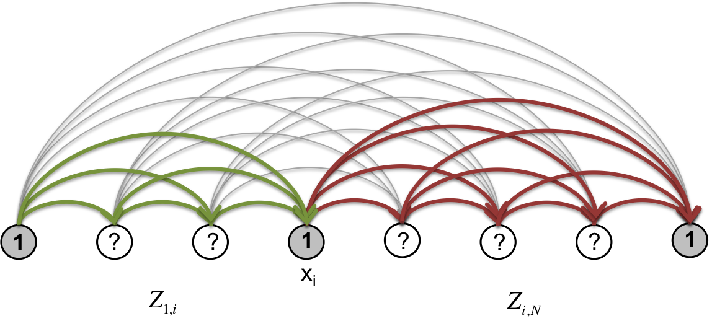

Algorithms
==========

Optimal segmentation
--------------------

The most probable segmentation is the one that has the greatest (log)
likelihood, or equivalently, is the lowest energy configuration of our
system (the *ground state*). If we place the segment energies on the
edges of the segmentation graph, and *sum the weights* along any given
path from source to sink, then this becomes a straightforward case of
**finding the shortest (longest) path** on this directed acyclic graph.

.. math::  s_{\textrm{opt}} = \arg\!\max_{s \in S} \left({ - \displaystyle\sum_{[i,j) \in s} E(i,j)}\right)

The optimal segmentation can be found in :math:`O(N^2)` time by dynamic
programming [Fillipova et al].

In the graphical models terminology, this algorithm goes by
the name *max sum*. It can be further optimized (linearly bounded) if a
maximum segment length is imposed.

Marginal probabilities
----------------------

Sub-partition functions
~~~~~~~~~~~~~~~~~~~~~~~

Now, if we place the segment statistical weights on the edges of the
segmentation graph and take the *product of weights* along any given
path from source to sink, then we can obtain the partition function
:math:`Z(\beta)` by **summing over all paths** starting at node
:math:`0` and ending at node :math:`N`. Furthermore, we can consider
segmentation "subsystems" spanning nodes :math:`i` through :math:`j`
(:math:`i < j`) and similarly compute the sub-partition function
:math:`Z_{i,j}` by summing over paths in that subsystem (see :ref:`figure-6`, :ref:`figure-7`). The full system partition function :math:`Z` is
equivalent to :math:`Z_{0,N}`. We have the following recursion
relations:

Forward sub-partition functions:

.. math:: 
   & Z_{0,0} \equiv 1, \\
   & Z_{0,t} = \displaystyle\sum_{k=0}^t Z_{0,k} e^{-\beta E(k,t)} \; \forall t \in \{1, \ldots, N \},

Backward sub-partition functions:

.. math::
   & Z_{N,N} \equiv 1, \\
   & Z_{N-t,N} = \displaystyle\sum_{k=0}^t Z_{N-k,N} e^{-\beta E(N-t,N-k)} \; \forall t \in \{1, \ldots, N \}.

This forms the basis of a dynamic programming algorithm that goes by
several names: *sum-product*, forward-backward, belief-propagation, and
others.

Marginal boundary probabilities
~~~~~~~~~~~~~~~~~~~~~~~~~~~~~~~

With these forward and backward statistical weight sums, the marginal
probability of each node being a boundary is obtained from

.. math::  p(x_i = 1) = \frac{Z_{0,i} Z_{i,N}}{Z_{0,N}} .

.. _figure-6:

   Fig. 6

   To get the marginal probability of node :math:`x_i` being a boundary,
   we need to sum over all paths that pass through it. This conditioning reduces
   the original ensemble to two isolated subsystems, "forward" (green) and "backward" (red).

Hence, although the number of segmentations is exponential in the number
of nodes, it is possible to compute the partition function and marginal
boundary probabilities in :math:`O(N^2)` time.

One can go further and compute the entire set of :math:`Z_{ij}` in
:math:`O(N^3)` and obtain co-occurrence probabilities for all pairs of
nodes. The marginal probability of two nodes co-occurring as segment
boundaries is given by

.. math::  p(x_i = 1, x_j = 1) = \frac{Z_{0,i} Z_{i,j} Z_{j,N}} {Z_{0,N}} 

.. _figure-7:

.. figure:: static/img/algo-bb_marginal.png
   :figwidth: 50%
   :align: center

   Fig. 7

   The subensemble conditioned on two nodes :math:`x_i` and :math:`x_j` both being boundaries splits the
   system into three isolated subsystems.

This formula can be generalized to any number of boundaries.

Marginal segment probabilities
~~~~~~~~~~~~~~~~~~~~~~~~~~~~~~

We can make use of the forward and backward sub-partition functions to
efficiently compute two other quantities of interest.

The marginal probability of the occurrence of a specific segment
:math:`[i,j)` is given by

.. math::  p(x_i = 1, x_j = 1, x_k = 0 \textrm{ for } i \lt k \lt j) = \frac{Z_{0,i} e^{-\beta E(i,j)} Z_{j,N}} {Z_{0,N}} 

.. _figure-8:

.. figure:: static/img/algo-s_marginal.png
   :figwidth: 50%
   :align: center

   Fig. 8

   Conditioning the segmentation ensemble on the occurrence of a specific segment (red line)
   reduces it to a combination of two isolated subsystems connected by a single arc.

With the forward and backward statistical weights computed as in the previous section, we
can further apply dynamic programming to sum up all paths such that
:math:`i`\ th and :math:`j`\ th genomic bin *co-occur in a common
segment*. By computing this for all pairs of bins, the resulting
marginal segment co-occurrence matrix gives a representation of the
ensemble that is easy to compare visually to the original Hi-C matrix.
The entire procedure does not exceed :math:`O(N^2)`.

.. math::  p( x_k = 0 \textrm{ for } i \lt k \le j) = \sum_{p = 0}^i \sum_{q =j+1}^N \frac{ Z_{0,p} e^{-\beta E(p,q)} Z_{q,N}}{Z_{0,N}} 

.. _figure-9:

.. figure:: static/img/algo-ss_marginal.png
   :figwidth: 50%
   :align: center

   Fig. 9

   To condition on bins :math:`[i, i+1)` and :math:`[j, j+1)` co-occurring within the same segment, we need to
   sum over all paths in which nodes :math:`x_{i+1}, \ldots, x_{j} = 0`.

Sampling
--------

It is possible to obtain independent samples from the ensemble by
performing stochastic backtracking walks on the segmentation graph. First, one must pre-compute the forward sub-partition functions. Then to generate samples one proceeds as follows:

-  Start at the sink boundary node :math:`N`. Choose a predecessor boundary node :math:`k` from the :math:`N-1`
   available choices by sampling the discrete distribution whose probabilities are given by:

.. math:: 
   p(N \to k) = \frac{Z_{0,k}}{Z_{0,N}}

-  Continue the backward random walk by sampling predecessor nodes :math:`k'` until the source node :math:`0` is reached.

.. math:: 
   p(k \to k') = \frac{Z_{0,k'}}{Z_{0,k}}

Alternatively, one can use the backward subpartition functions and stochastically walk from :math:`0` to :math:`N`.

Hence, samples can be generated without the need for Markov chain-based
sampling methods (e.g. Metropolis sampling), which produce correlated samples.

