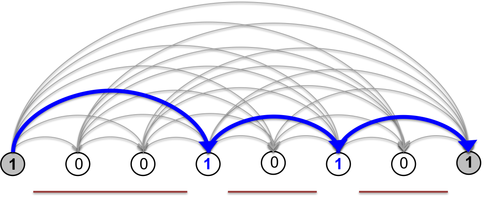

Theory
======

The segmentation path graph
-----------------------

To simplify the logic of handling intervals, it is common practice in
sequence analysis to use a 0-based coordinate system that labels
individual nucleotides, or ranges of nucleotides, by the coordinates
that flank them. Similarly, we define here a 0-based coordinate system
for genomic bins that labels individual bins by their edges (:ref:`figure-3`).

.. _figure-3:

   Fig. 3

   Top: Coordinate systems for a binned genomic region: segmentations are unambiguously expressed in 
   a 0-based or "edge-based" representation that designates which bin edges are the boundaries 
   between segments of genomic bins. Bottom: example segmentation (red lines) expressed in 
   binary notation.

For a symmetric genomic interaction heatmap (the same coordinates on
both axes), we have an ordered list of contiguous genomic bins, each of
which is an interval of one or more bases, represented by the following
bin edge labels:

.. math::  V = (0,1,2,\ldots, N). 

We define a **segment** as a set of *consecutive bins* according to the
sequence :math:`V`.

We define a **segmentation** :math:`s` as a collection of
*non-overlapping segments* that covers :math:`V` (i.e., no repeated
bins, no gaps).

We denote :math:`S` the **state space** of all segmentations over
:math:`V`.

In this coordinate system, any segment can be represented as a half-open
interval, denoted by pairs :math:`[a,b)`, where :math:`a \lt b`. For
example, the first bin is denoted :math:`[0,1)`, the segment spanning
the first five bins is denoted :math:`[0,5)`. We can represent
segmentations in several ways:

1. as sets of adjacent half-open intervals (e.g.,
   :math:`\\{ [0,3), [3,5), [5,8) \\}`)
2. as bit strings of length :math:`N+1`, where the bit values specify
   whether or not a boundary exists between two bins (1=boundary,
   0=non-boundary). Under this convention, the starting and final bits
   are always equal to 1. (e.g., 100101001 )
3. as a path along the segmentation graph (see below)

The bit string representation makes it clear that the state space has
size :math:`\|S\| = 2^{N-1}`. We can represent the entire state space
:math:`S` as a directed acyclic graph we call the **segmentation graph**
(:ref:`figure-4`). The nodes of the segmentation graph correspond
to the edges of genomic bins and all of the arcs point in the direction
of increasing genomic coordinate (from left to right as depicted in
:ref:`figure-4`). Each arc corresponds to a unique genomic segment.

.. _figure-4:

.. figure:: static/img/theory-seg-graph.png
   :alt: Segmentation path graph
   :figwidth: 75%
   :align: center

   Fig. 4

   The segmentation path graph. The nodes correspond to genomic bin edges.

In this graphical representation, any **segmentation** :math:`s` of the
genomic bins can be mapped uniquely to a **path** on the segmentation
graph starting at the left-most boundary (source) node and ending at the
the right-most boundary (sink) node, shown in grey. The nodes visited
are the segment boundaries, i.e. the 1s in the bit string representation
of the segmentation.

.. _figure-5:

   Fig. 5

   Nodes can take on states 0 (non-boundary) or 1 (segment boundary). The boundary
   nodes are the ones visited along a path from the source node to the sink node.

A statistical ensemble
----------------------

Let's assume we can associate every possible segment in :math:`V` with a
score or **energy** :math:`E(a,b)` that tells us how "good" a segment it
is. When thinking in terms of energies -- as opposed to scores -- lower
means "better".

If each segment :math:`[a,b)` making up a segmentation :math:`s`
provides an independent energetic contribution, we can define a
Hamiltonian for this system as the sum of energetic contributions:

.. math::  H(s) = \displaystyle\sum_{[a,b) \in s} { E(a,b) }
   :label: hamiltonian

Having a Hamiltonian formulation allows us to construct a probabilistic
model for the set of all segmentations using the framework of
statistical mechanics. We model segmentations in the bit string
representation as a thermal system in equilibrium with a heat bath. This
statistical ensemble is called the *canonical ensemble*, where states
(segmentations) obey the Boltzmann distribution

.. math::  p(s) = \frac{1}{Z} e^{-\beta H(s)},
   :label: boltzmann

where the normalization term :math:`Z`

.. math::  Z(\beta) = \sum_{s \in S} { e^{-\beta H(s)} } ,
   :label: paritition

is conventionally called the *partition function*, and :math:`\beta` is
the inverse temperature with units on the energy scale.

Notable properties of this model:

1. The total energy of a segmentation is the *sum* of the energies of
   its segments :eq:`hamiltonian`. Its statistical (Boltzmann) weight in the ensemble
   is given by :math:`e^{-\beta H(s)}`.
2. The statistical weight of a segmentation is also the *product* of the
   Boltzmann weights of its segments, :math:`e^{-\beta E(a,b)}`.

Essentially, we are treating the occurrences of *non-overlapping segments
as statistically independent*. This assumption allows us to represent the
ensemble by assigning arc weights to the segmentation graph. This
representation will illuminate efficient methods for obtaining exact
solutions for:

-  the maximum probability segmentation
-  the marginal probability for specific boundaries to occur
-  the marginal probability for specific segments to occur
-  marginal co-occurrence probabilities of specific nodes in either
   state (0 or 1)
-  independent samples from the ensemble

Depending on the algorithm, the weight we assign to the arc connecting :math:`a`
and :math:`b` is one of

1. segment energy :math:`E(a,b)`. The total energy of a segmentation
   :math:`s` is then the sum of the arc weights along its path in the
   segmentation graph.
2. segment statistical weight :math:`e^{-\beta E(a,b)}`. The statistical
   weight of a segmentation :math:`s` is then the product of the arc weights
   along its path in the segmentation graph.

The algorithms described below apply to any segment scoring function
that satisfies :eq:`boltzmann`. We will explore the results for a segment version of
the Potts energy model on Hi-C data.

